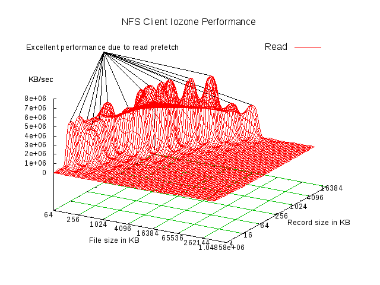

# QS-Storage-Gateway 性能测试报告及分析
<div style="width:50%; display: inline-block;text-align:left" >2018-06-21, 2018-06-22, 2018-06-23</div><div style="width:50%; display: inline-block;text-align:right">Jim Huang jimhuang@yunify.com
</div>

<br>
<br>

## 目录
1. [测试环境](#测试环境)
2. [测试方式](#测试方式)
<br>2.1 [测试工具](#测试工具)
<br>2.2 [对比测试结果](#对比测试结果)
<br>2.3 [测试命令](#测试命令)
<br>2.4 [工具的选择](#工具的选择)
3. [基准测试用例](#基准测试用例)
4. [测试结果](#测试结果)
<br>4.1 [NFS Client 读写性能三维图](#NFS%20Client%20读写性能三维图)
<br>4.2 [NFS Server Cluster - 2 Clients 读写性能三维图](#NFS%20Server%20Cluster%20-%202%20Clients%20读写性能三维图)
<br>4.3 [NFS Server Cluster - 4 Clients 读写性能三维图](#NFS%20Server%20Cluster%20-%204%20Clients%20读写性能三维图)
<br>4.4 [总结](#总结)
5. [测试结果分析](#测试结果分析)
<br>5.1 [性能瓶颈](#性能瓶颈)
<br>5.2 [如何提高读写性能](#如何提高读写性能)
6. [配置参数](#配置参数)
<br>6.1 [NFS Client 挂载参数](#NFS%20Client%20挂载参数)
<br>6.2 [qsfs-fuse 挂载参数](#qsfs-fuse%20挂载参数)
7. [测试过程](#测试过程)
<br>7.1 [NFS Client 测试](#NFS%20Client%20测试)
<br>7.2 [NFS Server Cluster 测试](#NFS%20Server%20Cluster%20测试)
8. [测试环境部署](#测试环境部署)
<br>8.1 [NFS](#NFS)
<br>8.2 [qsfs](#qsfs)
<br>8.3 [Iozone](#Iozone)
<br>8.4 [fio](#fio)
9. [附录](#附录)
<br>9.1 [Scripts](#Scripts)
<br>9.2 [NFS Troubleshooting](#NFS%20Troubleshooting)
<br>9.3 [测试数据结果](#测试数据结果)

<div style="page-break-after:always;"></div>

## 测试环境

测试基于 `dgb2` 对象存储环境． 

QS-Storage-Gateway 主要包括 qsfs-fuse 和 NFS 两部分: 通过 qsfs 将 QingStor 挂载至 Server 上指定目录, 在 Server 上部署 NFS 将该路径 export 给 NFS Clients, 在 NFS Client 端挂载该路径即可.

|     集群     |  部署节点  |
| ----------- | --------- |
| NFS Server  |  gateway1 |
| NFS Client0 |  gateway0 |
| NFS Client1 |  gateway2 |
| NFS Client2 |  gateway3 |
| NFS Client3 |  gateway4 |

## 测试方式

首先，采用以下三种工具进行对比测试，以此来确定测试数据的准确性．在对比测试之后,采用了 Iozone 对 QS-Storage-Gateway 进行 Benchmark 测试.

### 测试工具

- [dd][dd_man]
- [fio][fio_github]
- [iozone][iozone_org]

### 对比测试结果

对比测试对 NFS Client0 节点, 进行 64MB 文件大小的读写测试,测试结果如下, 测试命令见下节内容.

单位: Mbytes/s
|        |  Write  |  Read  |
| ------ |:-------:|:------:|
| dd     |  33.6   |  17.7  |
| iozone |  35.6   |  17.9  |
| fio    |  33.6   |  17.5  |

> 注: 对比测试未采用最新源码，最新源码有对 read prefetch 算法进行调整，读性能有所提升．

<div style="page-break-after:always;"></div>

### 测试命令

- dd

```sh
dd if=/dev/zero of=/mnt/nas-gw/bs128k_c2048.txt bs=128k count=2048  # write
dd if=/mnt/nas-gw/bs128k_c2048.txt of=/dev/null bs=128k count=2048  # read
```

- iozone

```sh
iozone -ce -i 0 -i 1 -r 128k -s 64m -+n -f /mnt/nas-gw/testfile.ioz
```

- fio

```sh
# filename=test_rw.fio
# 测试命令　fio test_rw.fio
[global]
runtime=180
directory=/mnt/nas-gw
end_fsync=1
bs=128k
size=64M
numjobs=1

[write_fio]
rw=write
filename=write64m.fio

[read_fio]
rw=read
filename=read64m.fio
```

### 工具的选择

Iozone 支持自动模式，覆盖了较全面的测试用例，支持对 NFS Cluster 测试. 本测试报告参考了 [Analyzing NFS Client Performance with Iozone][NFS_client_perf_iozone] 和 [Linux NFS HowTo][NFS_howto], 采用 Iozone 对 QS-Storage-Gateway 进行基准测试.

<div style="page-break-after: always;"></div>

## 基准测试用例

Benchmark 测试覆盖以下测试用例, 文件大小从 64K 至 512M, 对应的 IO 请求区块大小 (record size) 从 4K 至 16M. 其中当文件大小超过 32M 时, 不考虑 32K (包含) 以下的 IO 请求区块大小, 如下表所示, 总计 126 组.

单位: Kbytes
|        | 4 | 8 | 16 | 32 | 64 | 128 | 256 | 512 | 1024 | 2048 | 4096 | 8192 | 16384 |
| ------ |:-:|:-:|:--:|:--:|:--:|:---:|:---:|:---:|:----:|:----:|:----:|:----:|:-----:|
| 64     | x | x | x  | x  | x  |     |     |     |      |      |      |      |       |
| 128    | x | x | x  | x  | x  |  x  |     |     |      |      |      |      |       |
| 256    | x | x | x  | x  | x  |  x  |  x  |     |      |      |      |      |       |
| 512    | x | x | x  | x  | x  |  x  |  x  |  x  |      |      |      |      |       |
| 1024   | x | x | x  | x  | x  |  x  |  x  |  x  |  x   |      |      |      |       |
| 2048   | x | x | x  | x  | x  |  x  |  x  |  x  |  x   |  x   |      |      |       |
| 4096   | x | x | x  | x  | x  |  x  |  x  |  x  |  x   |  x   |  x   |      |       |
| 8192   | x | x | x  | x  | x  |  x  |  x  |  x  |  x   |  x   |  x   |  x   |       |
| 16384  | x | x | x  | x  | x  |  x  |  x  |  x  |  x   |  x   |  x   |  x   |   x   |
| 32768  |   |   |    |    | x  |  x  |  x  |  x  |  x   |  x   |  x   |  x   |   x   |
| 65536  |   |   |    |    | x  |  x  |  x  |  x  |  x   |  x   |  x   |  x   |   x   |
| 131072 |   |   |    |    | x  |  x  |  x  |  x  |  x   |  x   |  x   |  x   |   x   |
| 262144 |   |   |    |    | x  |  x  |  x  |  x  |  x   |  x   |  x   |  x   |   x   |
| 524288 |   |   |    |    | x  |  x  |  x  |  x  |  x   |  x   |  x   |  x   |   x   |

采用以上基准测试用例, 对以下三种部署环境进行测试, 总计测试 126 * 3 = 378 组．

|         | NFS Client 节点数 |  测试节点  |
| ------  |:-----------:| ---------- |
| Node    |      1      | NFS Client |
| Cluster |      2      | NFS Server |
| Cluster |      4      | NFS Server |

<div style="page-break-after:always;"></div>

## 测试结果

选取不同 IO 请求区块大小测试用例中最大值，64KB ~ 512MB 文件读写吞吐列表如下:

|  File Size  | Write(KB/s)  | | | Read(KB/s) |  |       |
| ------ |:-----:|:-----:|:-----:|:-----:|:-----:|:-----:|
|  (KB)  | nfs client | nfs cluster - 2 node |  nfs cluster - 4 node |  nfs client | nfs cluster - 2 node | nfs cluster - 4 node |
| 64     | 1923  | 1382  | 3859  | 2728  | 8815  | 17578 |
| 128    | 3405  | 2846  | 3314  | 3731  | 16724 | 34075 |
| 256    | 5647  | 4627  | 10000 | 6365  | 26769 | 34820 |
| 512    | 10537 | 8844  | 13416 | 8035  | 21394 | 22700 |
| 1024   | 16907 | 25913 | 29862 | 43835 | 38383 | 20714 |
| 2048   | 23474 | 20696 | 29018 | 64503 | 46940 | 20029 |
| 4096   | 28765 | 47792 | 31416 | 43286 | 24660 | 22357 |
| 8192   | 35164 | 16104 | 51739 | 30996 | 22481 | 21814 |
| 16384  | 39038 | 45110 | 64919 | 57404 | 24165 | 21513 |
| 32768  | 35211 | 35033 | 44316 | 45144 | 22975 | 21708 |
| 65536  | 36738 | 48803 | 51583 | 30554 | 21533 | 21027 |
| 131072 | 37946 | 50666 | 65804 | 24672 | 21167 | 21348 |
| 262144 | 38074 | 51673 | 71689 | 23707 | 20660 | 20143 |
| 524288 | 37924 | 57424 | 58015 | 22008 | 20281 | 19877 |
Table 1. Write/Read (不同 IO 请求区块大小测试用例中最大值)

> 注: 64KB ~ 16MB 文件 nfs client 读吞吐实测超出了百兆每秒，可能是 qsfs read prefetch (默认设置20M) 缓存的副作用，因此上表中未予考虑，详细数据见附录．

<div style="page-break-after:always;"></div>

选取不同 IO 请求区块大小测试用例中最大值，64KB ~ 512MB 文件二次读写吞吐列表如下:

|  File Size  | Rewrite(KB/s) |       | Reread(KB/s) |  |
| ----------- |:-----------:|:-----:|:-----:|:-----:|
|     (KB)    | nfs cluster - 2 node |  nfs cluster - 4 node |  nfs cluster - 2 node |  nfs cluster - 4 node |
| 64  | 24531 | 40119 | 2948642 | 5266527 |
| 128 | 42635 | 78722 | 3978034 | 8043305 |
| 256 | 79840 | 153946 | 5175558 | 10377317 |
| 512 | 138974 | 196633 | 6788905 | 11476927 |
| 1024 | 163719 | 229673 | 6691058 | 12966481 |
| 2048 | 176820 | 221052 | 6871187 | 14092444 |
| 4096 | 185808 | 239111 | 7380697 | 14461237 |
| 8192 | 192836 | 235030 | 7611258 | 11328903 |
| 16384 | 192039 | 248442 | 7993595 | 8474311 |
| 32768 | 195116 | 238681 | 7915608 | 9113957 |
| 65536 | 194980 | 240124 | 8087038 | 9564138 |
| 131072 | 194921 | 236181 | 8311883 | 10663316 |
| 262144 | 188815 | 232970 | 8463145 | 11512225 |
| 524288 | 186444 | 225202 | 8073504 | 11738873 |
Table 2. Rewrite/Reread (不同 IO 请求区块大小测试用例中最大值)

<div style="page-break-after:always;"></div>

对不同 IO 请求区块大小的测试用例结果求平均，64KB ~ 512MB 文件读写吞吐列表如下:

|  File Size  | Write(KB/s)  | | | Read(KB/s) |  |       |
| ------ |:-----:|:-----:|:-----:|:-----:|:-----:|:-----:|
|  (KB)  | nfs client | nfs cluster - 2 node |  nfs cluster - 4 node | nfs client |  nfs cluster - 2 node | nfs cluster - 4 node |
| 64 | 1135 | 598 | 1238 | 2278 | 6046 | 12178 |
| 128 | 636 | 1498 | 2244 | 2922 | 10177 | 20064 |
| 256 | 966 | 866 | 3319 | 3925 | 10089 | 17603 |
| 512 | 5267 | 5363 | 3940 | 6510 | 13051 | 15334 |
| 1024 | 9226 | 8331 | 11677 | 16005 | 19353 | 15020 |
| 2048 | 7684 | 10219 | 16031 | 20042 | 20937 | 15972 |
| 4096 | 9800 | 21883 | 16863 | 19093 | 20428 | 17337 |
| 8192 | 19668 | 11585 | 36493 | 21467 | 18970 | 18123 |
| 16384 | 18415 | 21996 | 42591 | 24916 | 20083 | 18505 |
| 32768 | 15498 | 25760 | 30846 | 17196 | 20376 | 18235 |
| 65536 | 18892 | 41038 | 39529 | 15732 | 20340 | 19485 |
| 131072 | 25153 | 43760 | 52902 | 15678 | 20856 | 19971 |
| 262144 | 24854 | 48810 | 57451 | 15301 | 20149 | 19660 |
| 524288 | 23381 | 49811 | 54946 | 14594 | 19794 | 17632 |
Table ３. Write/Read (不同 IO 请求区块大小下平均值)

> 注: 64KB ~ 16MB 文件 nfs client 读吞吐实测超出了百兆每秒，可能是 qsfs read prefetch (默认设置20M) 缓存的副作用，因此上表中未予考虑，详细数据见附录．

<div style="page-break-after:always;"></div>

对不同 IO 请求区块大小的测试用例结果求平均，64KB ~ 512MB 文件二次读写吞吐列表如下:

|  File Size  | Rerite(KB/s) |       | Reread(KB/s) |  |
| ----------- |:-----------:|:-----:|:-----:|:-----:|
|     (KB)    | nfs cluster - 2 node |  nfs cluster - 4 node |  nfs cluster - 2 node |  nfs cluster - 4 node |
| 64 | 21807 | 38653 | 2415866 | 4363480 |
| 128 | 39499 | 74419 | 3376288 | 5977261 |
| 256 | 73110 | 139584 | 4163780 | 8103401 |
| 512 | 117457 | 163575 | 5004744 | 9185782 |
| 1024 | 150686 | 199856 | 4734582 | 9964719 |
| 2048 | 167666 | 209034 | 5116628 | 11277661 |
| 4096 | 175727 | 221113 | 6076433 | 11459330 |
| 8192 | 181970 | 222480 | 6404363 | 7499527 |
| 16384 | 185319 | 229633 | 6609573 | 7370430 |
| 32768 | 189856 | 230662 | 6825029 | 7509012 |
| 65536 | 193097 | 234244 | 7107671 | 8168469 |
| 131072 | 191606 | 231905 | 7540772 | 9144398 |
| 262144 | 186990 | 228052 | 7564230 | 9760036 |
| 524288 | 184497 | 210981 | 7621585 | 9896701 |
Table 4. Rewrite/Reread (不同 IO 请求区块大小下平均值)

<div style="page-break-after:always;"></div>

测试结果三维图如下，测试数据表格详见附录.

> 测试结果的三维图制作采用了 gnuplot. 可参考 [Gnuplot Homepage][gnuplot_homepage], [A Quick Guide to Gnuplot][gnuplot_quickguide] 以及 [iozone gnuplot exmaple][iozone_gnuplot]．

### NFS Client 读写性能三维图

<figure>
  <center>
  <font size="2">  
  
  <figcaption>Figure 1. NFS Client Performance - Write</figcaption>
  </font>
</figure>

<figure>
  <center>
  <font size="2">  
  
  <figcaption>Figure 2. NFS Client Performance - Read</figcaption>
  </font>
</figure>

<figure>
  <center>
  <font size="2">  
  
  <figcaption>Figure 3. NFS Client Performance - Read (with Peak Removed)</figcaption>
  </font>
</figure>

<div style="page-break-after:always;"></div>

### NFS Server Cluster - 2 Clients 读写性能三维图

<figure>
  <center>
  <font size="2">  
  
  <figcaption>Figure 4. NFS Server Cluster - 2 Clients Performance - Write</figcaption>
  </font>
</figure>

<figure>
  <center>
  <font size="2">  
  
  <figcaption>Figure 5. NFS Server Cluster - 2 Clients Performance - Read</figcaption>
  </font>
</figure>

<figure>
  <center>
  <font size="2">  
  
  <figcaption>Figure 6. NFS Server Cluster - 2 Clients Performance - Rewrite</figcaption>
  </font>
</figure>

<figure>
  <center>
  <font size="2">  
  
  <figcaption>Figure 7. NFS Server Cluster - 2 Clients Performance - Reread</figcaption>
  </font>
</figure>

<div style="page-break-after:always;"></div>

### NFS Server Cluster - 4 Clients 读写性能三维图 

<figure>
  <center>
  <font size="2">  
  
  <figcaption>Figure 8. NFS Server Cluster - 4 Clients Performance - Write</figcaption>
  </font>
</figure>

<figure>
  <center>
  <font size="2">  
  
  <figcaption>Figure 9. NFS Server Cluster - 4 Clients Performance - Read</figcaption>
  </font>
</figure>

<figure>
  <center>
  <font size="2">  
  
  <figcaption>Figure 10. NFS Server Cluster - 4 Clients Performance - Rewrite</figcaption>
  </font>
</figure>

<figure>
  <center>
  <font size="2">  
  
  <figcaption>Figure 11. NFS Server Cluster - 4 Clients Performance - Reread</figcaption>
  </font>
</figure>

<div style="page-break-after:always;"></div>

### 总结

- 写吞吐最大值

  单节点情况下: 64KB ~ 512KB 大小文件，大概在 2 ~ 10 MB/s；1M ~ 4M 大小文件，大概在 20 ~ 30 MB/s; 8M ~ 512M 大小文件，大概在 35 MB/s左右.
  
  2 节点集群性能比单节点情况有约 50 ~ 60% 左右的提升，4 节点集群新能比 2 节点集群新能有 50% 左右提升.

- 读吞吐最大值

  单节点情况下: 64KB ~ 512KB 大小文件，大概在 2 ~ 10 MB/s；1M ~ 4M 大小文件，大概在 40 ~ 60 MB/s; 8M ~ 64M 大小文件，大概在 30 ~50 MB/s左右, 128M ~ 512M 大小文件，大概在 20 ~ 30 MB/s左右.

  集群的读性能未见有明显提高， 64KB ~ 512KB 大小文件有所增加； 1M ~ 64M 大小文有所下降； 128M ~ 512M 文件，性能相当．

- 二次写吞吐平均值

  2 节点集群： 随文件从 64KB 增大到 512MB, 二次写吞吐量从 20MB/s 增大到 约 200MB/s.

  4 节点集群二次写吞吐比 2 节点集群有 15% 左右提升．

- 二次读吞吐平均值

  2 节点集群： 随文件从 64KB 增大到 512MB, 二次写吞吐量从 200MB/s 增大到 约 800MB/s.

  4 节点集群二次写吞吐比 2 节点集群有 20% 左右提升．

<div style="page-break-after:always;"></div>

## 测试结果分析

### 性能瓶颈

通过以上测试结果，可以发现读的性能多数情况下（排除 read prefetch 副作用）表现不如写的性能，且读的性能没有随集群的规模有所增加．

具体原因如下：

 - 1. nfs 以及 fuse 的 IO 请求的区块大小是有限的. nfs 的 rsize/wsize 以及 fuse 的 max_write 最大可设置为 128K.

 - 2. fuse2.9.2 的读请求并没有支持 max_read 选项，测试中发现读的请求尺寸会有 4K, 8K, 16K, 到 128K 等不同请求，造成单节点测试小文件读的性能是写性能约一半左右．

 - 3. 在大文件的写请求的时候: qsfs 采用多段上传的方式，从而可以达到较好的性能，在集群规模增大时可以看到写的性能是增加的； 在大文件读请求的时候：由于请求时需要从 QingStor GET 数据，而 fuse 请求的区块大小为 4K ~ 128K 不等，这些请求在同步的情况下并不能进行合并，尽管 qsfs 支持并行下载大文件 (默认同多段上传，超过20M开启)，但是由于请求区块过小，并不会被触发，所以读的性能较差．

### 如何提高读写性能

- 读性能的提高，通过以上分析，可能需要对 fuse 的读请求进行合并，这样的话需要一方面采取异步读取的模式，或者改进现有的 read prefecth 算法，或者最简单的方法是针对具体应用场景进行测试，调整 read prefetch size.

- libfuse 在 2.9.2 版本之后有提供一些新的特性，比如 splicing, write back cache等，但是需要对应的内核态 fuse 对应进行升级．

<div style="page-break-after:always;"></div>

## 配置参数

对配置参数进行调优，期望在满足应用场景的条件下, 设置合理的参数配置来达到较好的性能.

主要包含 NFS client 的挂载和 NFS server export 目录所挂载的 qsfs 的挂载参数.

### NFS Client 挂载参数

关于如何优化 NFS 性能,可参考 [NFS HowTo: Optimizing NFS Performace][NFS_howto_opt_perf].

通过若干次设置参数对比, 最终确定 `rsize` 和 `wsize` 大小为 `128k`. NFS Client 挂载参数如下:

```sh
mount -t nfs -o vers=3,nolock,bg,hard,intr,rsize=131072,wsize=131072 <NFS SERVER IP>:/mnt/storage-gateway /mnt/nas-gw
```

> 注: `/mnt/storage-gateway` 是 NFS Sever export 的目录, `/mnt/nas-gw` 是 NFS Client 挂载目录.

其中,

`rsize, wszie` 该值设定 Client 与 Server 间传输数据的区块大小,默认大小是 `4K`. NFS vers3 理论上最大值由 Linux 内核常量 `NFSSVC_MAXBLKSIZE` 设定.

`hard` 当 Client 与 Server 两者有任何一部脱机, RPC 会持续呼叫直到对方恢复联机.

`intr` 当使用 hard 挂载时, RPC 持续呼叫中, 该次呼叫允许中断.

`bg` 当执行挂载时,挂载行为在后台执行.

[NFS HowTo][NFS_howto] 建议设置 `hard, intr` 参数, 这样出现事故恢复之后,服务会如期恢复正常.

### qsfs-fuse 挂载参数

qsfs-fuse 的挂载参数主要分为 qsfs 的参数和 fuse 的参数.

关于如何设置优化 fuse 的参数可以参考 [To FUSE or Not to FUSE: Performance of User-Space File Sytems][ToFuseNottoFuse] 以及 [libfuse Github page][libfuse_github]. 

libfuse 最新版本为 3.2.3, qsfs-fuse 测试时对应的版本是 2.9.2, 因此需要注意 fuse 挂载的参数有所不同.

qsfs 的参数需要考虑最大缓存的大小和是否开启 read prefetch.

本测试中 qsfs-fuse 挂载采用如下挂载参数:

```sh
qsfs <BUCKET> <MOUNT_POINT> -c=/etc/qsfs_gdb2.cred -z=gd2b -Z=2500 -H=stor.yunify.com -p=http -oallow_other -obig_writes -omax_write=131072 -J -d
```

`-obig_writes` 写请求采用大的区块尺寸, 默认写的单次区块大小为 4K.

`-omax_write` 设置最大写请求区块尺寸, 这里设置为 fuse 内部的最大值 32pages 即 128K.

`-Z` 为 qsfs max_cache 参数, 用来设置最大可使用的缓存空间,默认大小为 `200M`, 这里设置时需要考虑大于最大同时会打开文件的尺寸即可, 设置到 2500M 是由于测试用例最大的情况是 4节点的 512M 文件的情况会占用 512 * 4 = 2048 M.

`-J` 为打开 read prefetch 开关, 会在读的过程中预先下载部分数据,默认大小为 20M, 可以通过 `-j` 来设置单次 prefetch 的大小.


> 注:
> 1. fuse 2.9.4 文档中支持 `large_read` 和 `max_read` 操作, 但是测试环境 CentOS 7.2 中采用的 2.9.2 版本并不支持这两项参数.
>
> 2. 实际测试中, qsfs 的缓存仅仅在测试 4 节点 512M 的测试用例时,设置了 2100M 的 max_cache 值, 大多测试用例采用了默认值 200M, 建议采用较大的值,这样所有测试用例可以一次跑完. 这里如果设置值小于同时打开文件尺寸时,缓存会将部分数据写到某个本地文件.
>
> 3. read prefetch 并不一定能保证读的性能必定有所提高.
>
> 4. BUCKET 为 `gdb2` 上 bucket name, MOUNT_POINT 为 NFS Server 上 export 的目录.

<div style="page-break-after:always;"></div>


## 测试过程

在部署好 QS-Storage-Gateway 之后, 采用 Iozone 对 NFS Client 和 NFS Server Cluster 进行测试.

具体部署过程参考后续小节, 测试方法参考 [Analyzing NFS Client Performance with Iozone][NFS_client_perf_iozone] 及 [Iozone Filesystem Benchmark][iozone_doc].

### NFS Client 测试

NFS Cient 测试采用 Iozone auto 模式对单个 NFS Client 节点进行 Benchmark 测试.

Iozone 的命令设置如下:

```sh
iozone -Race -i 0 -i 1 -+n -U /mnt/nas-gw -f /mnt/nas-gw/nas-gw_client_test.ioz -b ./qs_nas-gw_client_rw_iozone.xls > qs_nas-gw_client_rw_iozone.log
```

`-R` log 中生成 Excel output.

`-a` 采用 Iozone 自动模式,会对 benchmark 测试覆盖的所有测试用例进行测试.

`-c` 计算时间包含 close.

`-e` 计算时间包含 flush(fsync, fflush).

`-i` 指定测试的类型 (0=write/rewrite, 1=read/reread).

`-+n` 关闭 rewrite 和 reread 测试.

`-U` 在测试用例之间进行 umount 和 remount 操作,这样可以清除 NFS Client 中的缓存.

`-f` 指定挂载目录下生成的测试文件名.

`-b` 生成 Excel 二进制文件.

> 注: 需要在 fstab 里添加 NFS, umount/remount 操作才可以正确执行, 具体参考后续部署相关小节.
> `/mnt/nas-gw` 为 NFS Client 工作目录，即挂载的目录．

### NFS Server Cluster 测试

NFS Server Cluster 测试采用 Iozone throughput mode 对 NFS Server 的吞吐进行测试，通过 `-+m` 指定 NFS Clients 的配置文件，以两节点 NFS Clients 为例，该配置文件格式如下:

```bash
# cluster_2nodes.conf
# client_ip  work_dir_on_client path_to_Iozone_on_client
10.16.141.21 /mnt/nas-gw /usr/bin/iozone
10.16.141.22 /mnt/nas-gw /usr/bin/iozone
```

以上 Iozone 命令运行于 NFS Server 上，在测试过程中，Iozone 启动一个控制进程，默认通过 rsh 远程在每个 NFS Client 上启动 Iozone，并控制其运行以及收集测试数据．本测试中采用 ssh 代替 rsh, 具体设置见后续部署小节．

Iozone throughput mode 不同于 auto mode, 需要自行设置 IO 区块大小和文件尺寸，以两节点 NFS Clients 单个测试用例为例，Iozone 命令如下：

```sh
iozone -ceC -i 0 -i 1 -r <record size> -s <file size> -t <process number> -+m cluster_2nodes.conf
```

`-c` 计算时间包含 close.

`-e` 计算时间包含 flush(fsync, fflush).

`-C` 日志中打印各个 NFS Clients 的数据.

`-i` 指定测试的类型 (0=write/rewrite, 1=read/reread).

`-r` 指定 IO 请求区块大小 (record size).

`-s` 指定测试文件的大小.

`-t` 开启 Iozone 吞吐模式 (throughtput mode), 指定执行的进程数目.

`-+m` 指定 NFS Cluster 测试中各 Clients 的配置信息.

> 注:
> 请勿采用 `-w` 选项，该选项在每次测试完成不对测试生成的文件进行清除，而测试过程中，Iozone 为每个 NFS Client 都生成了一个文件，比如对 "client0", 生成文件 "IOZONE.DUMMY.0"，所有测试用例都用到了相同文件，而 qsfs 会对最近使用的未删除文件进行缓存，导致测试的性能不真实．
> 另外，Iozone thoughout mode 不支持 `-U` 选项来对 NFS Clients 进行 Unmount/Mount 操作，该选项主要是考虑 NFS Client 端的 IO buffer cache, 通过 NFS Client 测试观察，该选项对测试数据影响很小．

Iozone Cluster 测试采用了 thoughout mode，不会像 auto mode 那样执行 benchmark 所有用例．

通过 script 生成所有 benchmark 测试用例 Iozone 执行命令, 详见附录．

<div style="page-break-after:always;"></div>

## 测试环境部署

系统环境: Linux 3.10.0-327.el7.x86_64

### NFS

- 安装

```sh
yum install nfs-utils
```

- NFS 服务端设定

1. 配置 /etc/exports

```bash
/mnt/storage-gateway 10.16.141.0/255.255.255.0(fsid=0,rw,no_root_squash,sync)
```

2. 启动 NFS 并测试

```sh
systemctl start rpcbind.service
systemctl start nfs.service
showmount -e
```

- NFS 客户端设定

```sh
mount -t nfs -o vers=3,nolock,bg,hard,intr,rsize=131072,wsize=131072 10.16.141.11:/mnt/storage-gateway /mnt/nas
```

参数说明详细见参数配置小节, 更多参考 [NFS HowTo][NFS_howto] 和 [NFS 服务器][vbird_NFS]．

### qsfs

- 安装

安装依赖

```sh
yum install gcc gcc-c++ git fuse fuse-devel libcurl-devel openssl-devel
```

安装 qsfs rpm 包, 见 [QingCloud Page](qsfs_qingcloud_page) 或 [Github Release Page][qsfs_github_release]

```sh
rpm -iv qsfs-version-el7_2.x86_64.rpm
```

推荐采用源码安装，详情见 [QingCloud Page](qsfs_qingcloud_page) 或 [Github Installation Page][qsfs_github_install]

- gdb2 创建 Bucket

  1. 添加 hosts

  ```sh
  139.198.127.164 console.w.yunify.com portal.w.yunify.com stor.qingstor.com gd2b.stor.yunify.com
  ```

  2. 访问控制台 console.w.yunify.com, 新建 Bucket 并创建密钥对．

> 注:
> 密钥是通用的，可以使用你现有的密钥对．

- 挂载

```sh
qsfs <BUCKET> <MOUNT_POINT> -c=/etc/qsfs_gdb2.cred -z=gd2b -Z=2500 -H=stor.yunify.com -p=http -oallow_other -obig_writes -omax_write=131072 -J -d
```

　　参数说明详细见参数配置小节．

### Iozone

```sh
wget http://ftp.tu-chemnitz.de/pub/linux/dag/redhat/el7/en/x86_64/rpmforge/RPMS/rpmforge-release-0.5.3-1.el7.rf.x86_64.rpm
rpm -Uvh rpmforge-release-0.5.3-1.el7.rf.x86_64.rpm
yum install iozone
```

更多参见 [Iozone centos7 install howto][iozone_centos_7_install_howto].

### fio

```sh
wget http://mirror.centos.org/centos/7/os/x86_64/Packages/libaio-devel-0.3.109-13.el7.x86_64.rpm
rpm -i libaio-devel # must install devel to enable libaio
git clone https://github.com/axboe/fio.git
cd fio
./configure
make && make install
```

更多见 [fio Github Page][fio_github]

<div style="page-break-after:always;"></div>

## 附录

### Scripts

- Generate NFS Sever Cluster jobs

```bash
#! /bin/bash
#
# Generate nfs server cluster iozone jobs
# Change the nodes number if cluster have more than 2 nodes
NODES="2"
SCRIPTS="run_nfs_cluster_2node_ioz_jobs.sh"
CLUSTER_FILE="cluster_2node.conf"
OUTPUT_FILE="qs_nas-gw_cluster_2node_rw_iozone.log"
IOZONE="iozone"
RECORDS1="4 8 16 32"
RECORDS2="64 128 256 512 1024 2048 4096 8192 16384"
FILESIZES1="64 128 256 512 1024 2048 4096 8192 16384"
FILESIZES2="32768 65536 131072 262144 524288"
FILESIZES="${FILESIZES1} ${FILESIZES2}"

echo "# run iozone nfs cluster jobs" > $SCRIPTS
for RECORD in `eval echo $RECORDS1`; do
  for FILESIZE in `eval echo $FILESIZES1`; do
    echo "$IOZONE -ceC -i 0 -i 1 -r $RECORD -s $FILESIZE -t $NODES -+m $CLUSTER_FILE >> $OUTPUT_FILE" >> $SCRIPTS  
  done
done

for RECORD in `eval echo $RECORDS2`; do
  for FILESIZE in `eval echo $FILESIZES`; do
    if [ $RECORD -le $FILESIZE ]; then
      echo "$IOZONE -ceC -i 0 -i 1 -r $RECORD -s $FILESIZE -t $NODES -+m $CLUSTER_FILE >> $OUTPUT_FILE" >> $SCRIPTS  
    fi
  done
done
```

- Generate Table for Iozone NFS Cluster throughtput test log

```sh
egrep "Command line|writers|reades" cluster_2node.log | sed 's/^.*=//' | sed 's/^.* -r //' | awk'{print $3 " " $1}' | paste -d ' ' - - - - -
```

> egrep "Command line|writers|readers"　# 提取 iozone 命令行，write/rewrite/read/reread 的数据行
>
> sed 's/^.*=//'　　          # 将 write/rewrite/read/reread 的数据行行首至 `=` 处替换为空
>
> sed 's/^.* -r //'          # 将 iozone 命令行行首至 ` -r ` 处替换为空
>
> awk '{print $3 " " $1}'    # 将以空格分隔的第三列和第一列依次输出
>
> paste -d ' ' - - - - -     # 将每五行(经过以上处理的 iozone 命令行，write/rewrite/read/reread 数据行)合并为一行


- Transpose Table in Libre Calc

```vb
Sub Transpose
  dim sheet1 as object
  dim sheet2 as object
  
  sheet1 = ThisComponent.Sheets(0)
  sheet2 = ThisComponent.Sheets(1)
  
  for row = 0 to 125
    dim r, c as Integer
    r = sheet1.getCellByPosition(0,row).Value/64
    r = log(r)/log(2) + 1
    c = sheet1.getCellByPosition(1,row).Value/4
    c = log(c)/log(2) + 1

    dim cell as object
    cell = sheet2.getCellByPosition(c,r)
    cell.Value = sheet1.getCellByPosition(2,row).Value

    cell = sheet2.getCellByPosition(c,r+15)
    cell.Value = sheet1.getCellByPosition(3,row).Value

    cell = sheet2.getCellByPosition(c,r+30)
    cell.Value = sheet1.getCellByPosition(4,row).Value

    cell = sheet2.getCellByPosition(c,r+45)
    cell.Value = sheet1.getCellByPosition(5,row).Value
  next row
End Sub

```

### NFS Troubleshooting

- [NFS Troubleshooting][NFS_troubleshooting]

- [NFS HowTo][NFS_howto]

- [NFS 服务器][vbird_NFS]

<div style="page-break-after:always;"></div>

### 测试数据结果

### NFS Client

| file size | record size | Write | Read |
| --------- |:-----------:|:-----:|:----:|
| 64 |       4 |    1850 |     2728 |
| 64 |       8 |    1923 |     1827 |
| 64 |      16 |    1812 |  4564786 |
| 64 |      32 |      40 |  4564786 |
| 64 |      64 |      52 |  3738358 |
| 128 |       4 |      78 |     3731 |
| 128 |       8 |      76 |     3242 |
| 128 |      16 |      81 |     1792 |
| 128 |      32 |      78 |  3445772 |
| 128 |      64 |      97 |  4012317 |
| 128 |     128 |    3405 |  5325799 |
| 256 |       4 |     148 |     6365 |
| 256 |       8 |     187 |     5060 |
| 256 |      16 |     194 |     1890 |
| 256 |      32 |     195 |     3540 |
| 256 |      64 |    5647 |     3386 |
| 256 |     128 |     198 |     3307 |
| 256 |     256 |     195 |  4496299 |
| 512 |       4 |    9600 |     6532 |
| 512 |       8 |   10197 |     8035 |
| 512 |      16 |     389 |     6098 |
| 512 |      32 |   10499 |     6160 |
| 512 |      64 |     265 |     5941 |
| 512 |     128 |   10537 |     6292 |
| 512 |     256 |     319 |  6757222 |
| 512 |     512 |     332 |  6652558 |
| 1024 |       4 |   15736 |    14807 |
| 1024 |       8 |     638 |    12287 |
| 1024 |      16 |   15713 |     9487 |
| 1024 |      32 |   15977 |    10686 |
| 1024 |      64 |     602 |     9869 |
| 1024 |     128 |   16079 |    11062 |
| 1024 |     256 |     787 |    43835 |
| 1024 |     512 |   16907 |  7306780 |
| 1024 |    1024 |     593 |  7008693 |
| 2048 |       4 |    1486 |    11862 |
| 2048 |       8 |   22404 |     9704 |
| 2048 |      16 |    1521 |    13412 |
| 2048 |      32 |    1234 |    12712 |
| 2048 |      64 |    1200 |    14345 |
| 2048 |     128 |   21252 |    15629 |
| 2048 |     256 |    1525 |    25366 |
| 2048 |     512 |    1541 |    12849 |
| 2048 |    1024 |   23474 |    64503 |
| 2048 |    2048 |    1202 |  6917293 |
| 4096 |       4 |   27756 |    20593 |
| 4096 |       8 |   28765 |    19189 |
| 4096 |      16 |    2385 |     7907 |
| 4096 |      32 |    3068 |    14274 |
| 4096 |      64 |    3071 |    15494 |
| 4096 |     128 |    2504 |    22001 |
| 4096 |     256 |    3718 |    14112 |
| 4096 |     512 |    3076 |    43286 |
| 4096 |    1024 |    2506 |    22407 |
| 4096 |    2048 |    2382 |    11667 |
| 4096 |    4096 |   28571 |  6941906 |
| 8192 |       4 |   34073 |    15722 |
| 8192 |       8 |    4586 |    17525 |
| 8192 |      16 |   34272 |    18204 |
| 8192 |      32 |    4635 |    16171 |
| 8192 |      64 |   33571 |    23501 |
| 8192 |     128 |   35164 |    14197 |
| 8192 |     256 |    5746 |    20253 |
| 8192 |     512 |    4808 |    28807 |
| 8192 |    1024 |   33878 |    20667 |
| 8192 |    2048 |    6177 |    30092 |
| 8192 |    4096 |   33345 |    30996 |
| 8192 |    8192 |    5766 |  3720275 |
| 16384 |       4 |   10570 |    21698 |
| 16384 |       8 |   39038 |    20346 |
| 16384 |      16 |   36932 |    22777 |
| 16384 |      32 |   36949 |    21736 |
| 16384 |      64 |   10052 |    23758 |
| 16384 |     128 |   11148 |    20928 |
| 16384 |     256 |   37813 |    19081 |
| 16384 |     512 |   10597 |    18748 |
| 16384 |    1024 |    8415 |    23433 |
| 16384 |    2048 |    8719 |    17357 |
| 16384 |    4096 |   11136 |    31727 |
| 16384 |    8192 |   10697 |    57404 |
| 16384 |   16384 |    7329 |  3299251 |
| 32768 |      64 |   15425 |    20182 |
| 32768 |     128 |   23050 |    22718 |
| 32768 |     256 |   19475 |    21340 |
| 32768 |     512 |   14856 |    24521 |
| 32768 |    1024 |   24962 |    20959 |
| 32768 |    2048 |   27275 |    22126 |
| 32768 |    4096 |   35211 |    24006 |
| 32768 |    8192 |   20579 |    22551 |
| 32768 |   16384 |   20644 |    45144 |
| 65536 |      64 |   36495 |    20322 |
| 65536 |     128 |   20986 |    23019 |
| 65536 |     256 |   36738 |    23547 |
| 65536 |     512 |   27008 |    20207 |
| 65536 |    1024 |   19472 |    22421 |
| 65536 |    2048 |   22622 |    20359 |
| 65536 |    4096 |   36383 |    22990 |
| 65536 |    8192 |   25897 |    21094 |
| 65536 |   16384 |   19998 |    30554 |
| 131072 |      64 |   37606 |    24672 |
| 131072 |     128 |   37559 |    21449 |
| 131072 |     256 |   37946 |    22565 |
| 131072 |     512 |   37883 |    21956 |
| 131072 |    1024 |   37239 |    22102 |
| 131072 |    2048 |   36437 |    24117 |
| 131072 |    4096 |   37480 |    19887 |
| 131072 |    8192 |   37789 |    23138 |
| 131072 |   16384 |   27047 |    23934 |
| 262144 |      64 |   38032 |    22343 |
| 262144 |     128 |   37540 |    20228 |
| 262144 |     256 |   33299 |    20235 |
| 262144 |     512 |   37762 |    23707 |
| 262144 |    1024 |   37882 |    22963 |
| 262144 |    2048 |   28856 |    21064 |
| 262144 |    4096 |   33613 |    23497 |
| 262144 |    8192 |   38074 |    21451 |
| 262144 |   16384 |   38049 |    23430 |
| 524288 |      64 |   37531 |    21087 |
| 524288 |     128 |   36729 |    22008 |
| 524288 |     256 |   35032 |    20445 |
| 524288 |     512 |   34940 |    21242 |
| 524288 |    1024 |   27095 |    20249 |
| 524288 |    2048 |   28377 |    21854 |
| 524288 |    4096 |   36509 |    19932 |
| 524288 |    8192 |   29811 |    21033 |
| 524288 |   16384 |   37924 |    21875 |

#### NFS Server Cluster - 2 NFS Clients

| file size | record size | Write | Rewrite | Read | Reread|
| --------- |:-----------:|:-----:|:-------:|:----:|:-----:|
| 64 | 4 | 100 | 21607 | 3385 | 2948642 |
| 64 | 8 | 1329 | 24531 | 2405 | 2649053 |
| 64 | 16 | 1382 | 20543 | 7882 | 2379540 |
| 64 | 32 | 77 | 20553 | 7744 | 2274457 |
| 64 | 64 | 100 | 21801 | 8815 | 1827638 |
| 128 | 4 | 226 | 38735 | 5623 | 3945362 |
| 128 | 8 | 2834 | 42635 | 4697 | 3522134 |
| 128 | 16 | 156 | 33076 | 3071 | 3681252 |
| 128 | 32 | 2691 | 40934 | 15310 | 3978034 |
| 128 | 64 | 234 | 41280 | 16724 | 2861025 |
| 128 | 128 | 2846 | 40336 | 15634 | 2269923 |
| 256 | 4 | 174 | 77871 | 6099 | 4924949 |
| 256 | 8 | 4627 | 77645 | 7808 | 5175558 |
| 256 | 16 | 176 | 74338 | 3314 | 5049705 |
| 256 | 32 | 172 | 74816 | 5930 | 4726821 |
| 256 | 64 | 265 | 76904 | 5462 | 3645090 |
| 256 | 128 | 290 | 79840 | 15241 | 3235579 |
| 256 | 256 | 357 | 50354 | 26769 | 2388759 |
| 512 | 4 | 7615 | 138974 | 8864 | 5444831 |
| 512 | 8 | 8844 | 136161 | 8147 | 6788905 |
| 512 | 16 | 638 | 134061 | 9399 | 6150705 |
| 512 | 32 | 8169 | 136382 | 10114 | 5405373 |
| 512 | 64 | 8228 | 131611 | 10318 | 5144989 |
| 512 | 128 | 612 | 132374 | 21394 | 4621728 |
| 512 | 256 | 8325 | 2848 | 16842 | 3949079 |
| 512 | 512 | 476 | 127247 | 19329 | 2532347 |
| 1024 | 4 | 1037 | 141892 | 26680 | 6328933 |
| 1024 | 8 | 14415 | 149627 | 20793 | 6691058 |
| 1024 | 16 | 1860 | 163719 | 8555 | 3368972 |
| 1024 | 32 | 13837 | 158981 | 13022 | 6338932 |
| 1024 | 64 | 14114 | 124876 | 8347 | 3122922 |
| 1024 | 128 | 25913 | 159432 | 21107 | 5713973 |
| 1024 | 256 | 731 | 156652 | 38383 | 4574650 |
| 1024 | 512 | 1750 | 152358 | 20385 | 3811340 |
| 1024 | 1024 | 1319 | 148640 | 16902 | 2660460 |
| 2048 | 4 | 20696 | 172052 | 20475 | 3232959 |
| 2048 | 8 | 15011 | 160055 | 17817 | 3651045 |
| 2048 | 16 | 14161 | 166880 | 15042 | 6857364 |
| 2048 | 32 | 2540 | 176820 | 15794 | 6871187 |
| 2048 | 64 | 5110 | 172461 | 12728 | 6612440 |
| 2048 | 128 | 2722 | 165566 | 20599 | 6084503 |
| 2048 | 256 | 1775 | 175677 | 29139 | 6131947 |
| 2048 | 512 | 17025 | 167656 | 19070 | 5177019 |
| 2048 | 1024 | 3104 | 160482 | 46940 | 3919149 |
| 2048 | 2048 | 20045 | 159015 | 11771 | 2628672 |
| 4096 | 4 | 45439 | 175266 | 24338 | 6860678 |
| 4096 | 8 | 25395 | 174967 | 23691 | 7344862 |
| 4096 | 16 | 6712 | 185808 | 18670 | 7380697 |
| 4096 | 32 | 21169 | 182929 | 21279 | 7232152 |
| 4096 | 64 | 3139 | 183940 | 17441 | 6879077 |
| 4096 | 128 | 5406 | 174048 | 17646 | 6840703 |
| 4096 | 256 | 24631 | 174064 | 18751 | 6761928 |
| 4096 | 512 | 47792 | 178061 | 20393 | 5889395 |
| 4096 | 1024 | 28695 | 157812 | 21306 | 5168689 |
| 4096 | 2048 | 26199 | 169385 | 24660 | 3837042 |
| 4096 | 4096 | 6139 | 176722 | 16530 | 2645544 |
| 8192 | 4 | 13653 | 173556 | 18318 | 7028321 |
| 8192 | 8 | 8514 | 185573 | 20016 | 7524224 |
| 8192 | 16 | 11739 | 192836 | 18665 | 7611258 |
| 8192 | 32 | 13051 | 174819 | 15228 | 7560618 |
| 8192 | 64 | 12508 | 184081 | 16604 | 7352382 |
| 8192 | 128 | 13225 | 191432 | 21939 | 7216835 |
| 8192 | 256 | 4671 | 174810 | 21841 | 7431908 |
| 8192 | 512 | 14237 | 180275 | 22481 | 6746680 |
| 8192 | 1024 | 12170 | 178307 | 19322 | 6259336 |
| 8192 | 2048 | 9626 | 187249 | 17947 | 5446363 |
| 8192 | 4096 | 9518 | 180011 | 16243 | 4034156 |
| 8192 | 8192 | 16104 | 180691 | 19031 | 2640274 |
| 16384 | 4 | 37666 | 179489 | 20216 | 6966359 |
| 16384 | 8 | 16589 | 188780 | 24165 | 7652168 |
| 16384 | 16 | 13235 | 189673 | 17551 | 7631606 |
| 16384 | 32 | 24701 | 190994 | 19058 | 7993595 |
| 16384 | 64 | 17919 | 181843 | 24064 | 7406647 |
| 16384 | 128 | 24283 | 187407 | 22496 | 7973905 |
| 16384 | 256 | 20651 | 192039 | 21137 | 7454639 |
| 16384 | 512 | 16209 | 182548 | 21486 | 7276812 |
| 16384 | 1024 | 19286 | 190531 | 23084 | 6982172 |
| 16384 | 2048 | 14349 | 183551 | 20614 | 6560988 |
| 16384 | 4096 | 45110 | 184333 | 17261 | 5402261 |
| 16384 | 8192 | 19552 | 182249 | 19336 | 3979121 |
| 16384 | 16384 | 16394 | 175706 | 10612 | 2644180 |
| 32768 | 64 | 31538 | 194545 | 19327 | 7913302 |
| 32768 | 128 | 21882 | 189701 | 20615 | 7915608 |
| 32768 | 256 | 21871 | 185279 | 20622 | 7825837 |
| 32768 | 512 | 35033 | 195116 | 22975 | 7833441 |
| 32768 | 1024 | 18916 | 186968 | 20835 | 7430548 |
| 32768 | 2048 | 33315 | 192615 | 19279 | 7190949 |
| 32768 | 4096 | 19244 | 190391 | 21445 | 6155379 |
| 32768 | 8192 | 28836 | 189578 | 21614 | 5338825 |
| 32768 | 16384 | 21204 | 184510 | 16672 | 3821375 |
| 65536 | 64 | 45965 | 194455 | 20310 | 8087038 |
| 65536 | 128 | 29921 | 193583 | 20092 | 7857507 |
| 65536 | 256 | 47770 | 194980 | 20878 | 7719511 |
| 65536 | 512 | 46409 | 189133 | 20150 | 7887745 |
| 65536 | 1024 | 48803 | 194847 | 20294 | 6886533 |
| 65536 | 2048 | 35134 | 194282 | 21533 | 7353084 |
| 65536 | 4096 | 40382 | 193470 | 19319 | 6983979 |
| 65536 | 8192 | 37782 | 189003 | 20050 | 6324716 |
| 65536 | 16384 | 37176 | 194120 | 20429 | 4868931 |
| 131072 | 64 | 50666 | 194921 | 21093 | 8311883 |
| 131072 | 128 | 48893 | 192554 | 20386 | 8152284 |
| 131072 | 256 | 46821 | 190630 | 20961 | 8165272 |
| 131072 | 512 | 41108 | 193835 | 20968 | 8008627 |
| 131072 | 1024 | 35852 | 189790 | 20934 | 7984054 |
| 131072 | 2048 | 50465 | 191009 | 21167 | 7696151 |
| 131072 | 4096 | 38586 | 192985 | 21156 | 7530115 |
| 131072 | 8192 | 43137 | 189501 | 20762 | 6826002 |
| 131072 | 16384 | 38317 | 189233 | 20275 | 5192562 |
| 262144 | 64 | 44192 | 184712 | 20090 | 8463145 |
| 262144 | 128 | 49968 | 188815 | 20202 | 8229763 |
| 262144 | 256 | 51673 | 188646 | 20002 | 8056630 |
| 262144 | 512 | 50221 | 184671 | 20008 | 7096337 |
| 262144 | 1024 | 48768 | 187056 | 19992 | 7885961 |
| 262144 | 2048 | 49211 | 187514 | 20660 | 7149966 |
| 262144 | 4096 | 44510 | 186208 | 20440 | 7687521 |
| 262144 | 8192 | 50467 | 187156 | 19648 | 7280697 |
| 262144 | 16384 | 50280 | 188131 | 20296 | 6228055 |
| 524288 | 64 | 50056 | 184429 | 20118 | 8073504 |
| 524288 | 128 | 48253 | 182541 | 19478 | 7687854 |
| 524288 | 256 | 49109 | 183656 | 19065 | 7656725 |
| 524288 | 512 | 49612 | 186444 | 19743 | 7979266 |
| 524288 | 1024 | 52462 | 183764 | 19506 | 7847755 |
| 524288 | 2048 | 54819 | 185149 | 19881 | 8023919 |
| 524288 | 4096 | 42125 | 185708 | 19882 | 7792397 |
| 524288 | 8192 | 57424 | 184848 | 20281 | 6901286 |
| 524288 | 16384 | 44435 | 183931 | 20188 | 6631560 |

#### NFS Server Cluster - 4 NFS Clients

| file size | record size | Write | Rewrite | Read | Reread|
| --------- |:-----------:|:-----:|:-------:|:----:|:-----:|
| 64 | 4 | 3859 | 39916 | 6062 | 5266527 |
| 64 | 8 | 236 | 39641 | 4935 | 4835512 |
| 64 | 16 | 513 | 40119 | 16007 | 4507654 |
| 64 | 32 | 1351 | 37397 | 16309 | 4169601 |
| 64 | 64 | 232 | 36191 | 17578 | 3038107 |
| 128 | 4 | 321 | 74765 | 9978 | 7000778 |
| 128 | 8 | 2997 | 75150 | 8917 | 8043305 |
| 128 | 16 | 2809 | 72207 | 6099 | 6410382 |
| 128 | 32 | 850 | 78722 | 34075 | 5311689 |
| 128 | 64 | 3172 | 76414 | 28868 | 4942222 |
| 128 | 128 | 3314 | 69255 | 32446 | 4155191 |
| 256 | 4 | 1005 | 132943 | 14549 | 9700780 |
| 256 | 8 | 4980 | 120491 | 13776 | 10377317 |
| 256 | 16 | 10000 | 143886 | 6073 | 9738889 |
| 256 | 32 | 726 | 153946 | 10918 | 8595683 |
| 256 | 64 | 563 | 140598 | 11083 | 7659436 |
| 256 | 128 | 1420 | 139703 | 32002 | 6352560 |
| 256 | 256 | 4539 | 145518 | 34820 | 4299140 |
| 512 | 4 | 1106 | 196633 | 17475 | 11476927 |
| 512 | 8 | 1751 | 160486 | 14869 | 8862522 |
| 512 | 16 | 2114 | 151323 | 12777 | 11238315 |
| 512 | 32 | 1214 | 161165 | 16511 | 10865997 |
| 512 | 64 | 7951 | 147187 | 11847 | 10281194 |
| 512 | 128 | 1660 | 170394 | 22700 | 8730263 |
| 512 | 256 | 13416 | 154429 | 10809 | 7009207 |
| 512 | 512 | 2307 | 166984 | 15687 | 5021835 |
| 1024 | 4 | 4409 | 229673 | 13791 | 12476076 |
| 1024 | 8 | 13103 | 189395 | 20714 | 12966481 |
| 1024 | 16 | 6612 | 201527 | 14421 | 12122999 |
| 1024 | 32 | 11293 | 191914 | 17582 | 9384277 |
| 1024 | 64 | 3116 | 200662 | 16134 | 9359250 |
| 1024 | 128 | 12371 | 181895 | 14182 | 11311310 |
| 1024 | 256 | 29862 | 201433 | 12496 | 9459185 |
| 1024 | 512 | 14719 | 204484 | 10969 | 7535662 |
| 1024 | 1024 | 9609 | 197722 | 14892 | 5067236 |
| 2048 | 4 | 17473 | 212409 | 16548 | 13528237 |
| 2048 | 8 | 5250 | 212394 | 18881 | 14092444 |
| 2048 | 16 | 18911 | 217139 | 14699 | 13371490 |
| 2048 | 32 | 6487 | 221052 | 17370 | 13377183 |
| 2048 | 64 | 21428 | 201687 | 15943 | 13307430 |
| 2048 | 128 | 17987 | 218536 | 16140 | 12201105 |
| 2048 | 256 | 23276 | 202043 | 20029 | 12159502 |
| 2048 | 512 | 15537 | 203904 | 19649 | 9628217 |
| 2048 | 1024 | 4941 | 191906 | 13607 | 5957388 |
| 2048 | 2048 | 29018 | 209270 | 6854 | 5153620 |
| 4096 | 4 | 29547 | 230288 | 22357 | 13585916 |
| 4096 | 8 | 12239 | 239111 | 18379 | 14461237 |
| 4096 | 16 | 8956 | 225927 | 17767 | 14161962 |
| 4096 | 32 | 31416 | 214758 | 19162 | 10801633 |
| 4096 | 64 | 16127 | 212446 | 18244 | 14168601 |
| 4096 | 128 | 14888 | 232527 | 21090 | 13885045 |
| 4096 | 256 | 12869 | 227948 | 20014 | 10127397 |
| 4096 | 512 | 9297 | 218381 | 17716 | 11623080 |
| 4096 | 1024 | 8922 | 232903 | 15391 | 10121772 |
| 4096 | 2048 | 19332 | 219999 | 12557 | 7813727 |
| 4096 | 4096 | 21901 | 177952 | 8026 | 5302257 |
| 8192 | 4 | 51739 | 207944 | 21814 | 7270654 |
| 8192 | 8 | 32853 | 217960 | 19939 | 11328903 |
| 8192 | 16 | 43232 | 222369 | 19167 | 8036861 |
| 8192 | 32 | 48027 | 228926 | 20471 | 8037405 |
| 8192 | 64 | 22181 | 212195 | 19687 | 7902519 |
| 8192 | 128 | 33862 | 229175 | 18715 | 7692642 |
| 8192 | 256 | 31790 | 235030 | 21446 | 8188201 |
| 8192 | 512 | 32104 | 227489 | 20182 | 7449574 |
| 8192 | 1024 | 28037 | 225901 | 17007 | 6753645 |
| 8192 | 2048 | 27785 | 219340 | 16384 | 5891539 |
| 8192 | 4096 | 45880 | 227013 | 16271 | 6137811 |
| 8192 | 8192 | 40425 | 216421 | 6397 | 5304567 |
| 16384 | 4 | 39536 | 226160 | 21242 | 7914805 |
| 16384 | 8 | 64919 | 228005 | 19934 | 7696153 |
| 16384 | 16 | 61373 | 223411 | 18648 | 8474311 |
| 16384 | 32 | 33209 | 222917 | 20315 | 8344516 |
| 16384 | 64 | 31803 | 226775 | 20185 | 8433326 |
| 16384 | 128 | 30301 | 224223 | 21034 | 7919332 |
| 16384 | 256 | 49418 | 235771 | 21513 | 8231546 |
| 16384 | 512 | 28884 | 248442 | 20979 | 8279813 |
| 16384 | 1024 | 47877 | 234144 | 18498 | 7262197 |
| 16384 | 2048 | 46433 | 227661 | 19252 | 6682821 |
| 16384 | 4096 | 34470 | 233666 | 16420 | 5543777 |
| 16384 | 8192 | 44267 | 229654 | 14102 | 5750091 |
| 16384 | 16384 | 41191 | 224396 | 8443 | 5282905 |
| 32768 | 64 | 28169 | 229603 | 21708 | 8808941 |
| 32768 | 128 | 33060 | 225380 | 20380 | 8237094 |
| 32768 | 256 | 32955 | 238681 | 19889 | 8653770 |
| 32768 | 512 | 26721 | 228131 | 20729 | 9113957 |
| 32768 | 1024 | 44316 | 228046 | 19996 | 7875511 |
| 32768 | 2048 | 27754 | 231961 | 18755 | 7242709 |
| 32768 | 4096 | 29449 | 234582 | 15780 | 6712773 |
| 32768 | 8192 | 29246 | 226754 | 14595 | 5369520 |
| 32768 | 16384 | 25941 | 232824 | 12286 | 5566836 |
| 65536 | 64 | 43108 | 227435 | 21027 | 8972819 |
| 65536 | 128 | 39382 | 227938 | 20626 | 8612475 |
| 65536 | 256 | 34606 | 240124 | 20109 | 9021492 |
| 65536 | 512 | 38220 | 238036 | 20800 | 9560323 |
| 65536 | 1024 | 51583 | 234896 | 20699 | 9564138 |
| 65536 | 2048 | 39915 | 235857 | 20325 | 9030703 |
| 65536 | 4096 | 35432 | 236300 | 18557 | 7459106 |
| 65536 | 8192 | 33604 | 235800 | 17872 | 6424687 |
| 65536 | 16384 | 39911 | 231813 | 15349 | 4870477 |
| 131072 | 64 | 65804 | 222082 | 20164 | 10053804 |
| 131072 | 128 | 53349 | 229433 | 20574 | 10663316 |
| 131072 | 256 | 48915 | 236181 | 20575 | 9429479 |
| 131072 | 512 | 50225 | 233281 | 21152 | 9208645 |
| 131072 | 1024 | 51486 | 231869 | 21348 | 10372198 |
| 131072 | 2048 | 47045 | 235329 | 20031 | 10396057 |
| 131072 | 4096 | 48282 | 233278 | 19530 | 9127520 |
| 131072 | 8192 | 56973 | 234836 | 18564 | 7159909 |
| 131072 | 16384 | 54035 | 230861 | 17797 | 5888651 |
| 262144 | 64 | 71689 | 222946 | 20143 | 11512225 |
| 262144 | 128 | 69602 | 223935 | 19895 | 11056335 |
| 262144 | 256 | 59933 | 229173 | 19325 | 10600167 |
| 262144 | 512 | 50161 | 226153 | 19949 | 10760487 |
| 262144 | 1024 | 52341 | 230808 | 19747 | 10049398 |
| 262144 | 2048 | 53931 | 229963 | 19709 | 9777074 |
| 262144 | 4096 | 55387 | 232970 | 19491 | 9690575 |
| 262144 | 8192 | 51197 | 225872 | 19483 | 7935149 |
| 262144 | 16384 | 52817 | 230647 | 19202 | 6458917 |
| 524288 | 64 | 51298 | 113857 | 3402 | 11738873 |
| 524288 | 128 | 58015 | 223464 | 19548 | 10794695 |
| 524288 | 256 | 53146 | 223330 | 19877 | 10562158 |
| 524288 | 512 | 57912 | 223430 | 19370 | 10583686 |
| 524288 | 1024 | 52630 | 221963 | 19491 | 9723909 |
| 524288 | 2048 | 56082 | 222197 | 19414 | 10806981 |
| 524288 | 4096 | 53739 | 225202 | 19242 | 9670732 |
| 524288 | 8192 | 56574 | 223332 | 18999 | 8359013 |
| 524288 | 16384 | 55116 | 222051 | 19342 | 6830261 |

[qsfs_github_install]:https://github.com/yunify/qsfs-fuse/blob/master/INSTALL.md
[qsfs_github_release]:https://github.com/yunify/qsfs-fuse/releases
[qsfs_qingcloud]:https://docs.qingcloud.com/qingstor/developer_tools/qsfs
[libfuse_github]:https://github.com/libfuse/libfuse
[ToFuseNottoFuse]:https://www.usenix.org/system/files/conference/fast17/fast17-vangoor.pdf
[dd_man]:http://man7.org/linux/man-pages/man1/dd.1.html
[fio_github]:https://github.com/axboe/fio
[fio2gnuplot]:https://github.com/axboe/fio/blob/master/tools/plot/fio2gnuplot.manpage
[iozone_org]:http://www.iozone.org/
[iozone_doc]:http://www.iozone.org/docs/Iozone_msword_98.pdf
[iozone_gnuplot]:http://www.iozone.org/src/current/
[NFS_howto]:http://NFS.sourceforge.net/NFS-howto/
[NFS_howto_opt_perf]:http://NFS.sourceforge.net/NFS-howto/ar01s05.html
[NFS_troubleshooting]:http://nfs.sourceforge.net/nfs-howto/ar01s07.html
[vbird_NFS]:http://cn.linux.vbird.org/linux_server/0330NFS.php
[NFS_client_perf_iozone]:http://www.iozone.org/docs/NFSClientPerf_revised.pdf
[gnuplot_quickguide]:http://personalpages.to.infn.it/~mignone/Algoritmi_Numerici/gnuplot.pdf
[gnuplot_homepage]:http://www.gnuplot.info/
[iozone_centos_7_install_howto]:https://centos.pkgs.org/7/repoforge-x86_64/iozone-3.424-1.el7.rf.x86_64.rpm.html
